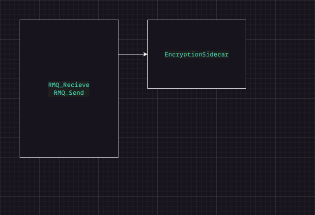

# Week 48 - Design Patterns
## Objectives
This week is a self-study on microservices design patterns. You should have be now already implemented one, the API gateway. The goal is to learn more about popular microservices design patterns and implement one in your Twitter system.


# Tasks
1. [goto](#1-research) **Research popular microservices design patterns.**
2. [goto](#2-identify) **Identify a design pattern that is a good fit for your Twitter system.**
3. [goto](#3-implement) **Implement the design pattern in your Twitter system.**


## 1. Research / Identify
This section of the document contains the mindset I had during my research.

* The **sidecar** design pattern offers the opportunity to split elements into different components, which can be run on the same process but can also run independently. This provides isolation of services.
* The **Saga** design pattern was designed to help manage long-running business processes by breaking them down into smaller, independent tasks, often referred to as "legs." Each task is executed in sequence, and if one fails, they are rolled back to the previous state.
* **Event-sourcing** is an architectural style that stores the history of an application's state as a sequence of events. By storing each state transition as a separate event, along with relevant metadata such as timestamps and version numbers.

### Conclusion
Given the simplicity of the system we're working on at the moment, I find the sidecar design pattern most useful when combined with Event-sourcing. The Saga pattern doesn't seem like the right choice for our system, as it would add unnecessary complexity to the sequential calls that are already small. On the other hand, using the Saga pattern for this kind of system might be too much given its current functions; therefore, I believe the sidecar pattern is a better fit for now.

I utilize TCP-Socket with Rabbit MQ to handle communication between services. Consequently, the sidecar could be linked together to handle encryption of data, as well as receiving keys and handling that part of the system.


### 3. Implement
The usage of the encryption class will be run on the same process, since they are linked closely together, the class handle the encryption and decryption of the
network stream. 



**Source code**
````csharp

  // Part of the RMQ_Receive class
  public void StartListening(Func<byte[], byte[]> handleMessage)
  {
    string consumerTag = channel.BasicConsume(queue: QueueName, autoAck: false, consumer: Consumer);
    Consumer.Received += (model, arg) =>
    {
      try{

        Sidecar<EncryptionSidecar> sidecar = new Sidecar<EncryptionSidecar>(); // <- Created the sidecar class.

        var body = arg.Body.ToArray();
        byte[] response = sidecar.Get().Decrypt(handleMessage(body)); // <- Using the Sidecar  class to decrypt the message.

        if (arg.BasicProperties?.ReplyTo != null){
          var replyProps = channel.CreateBasicProperties();
          replyProps.CorrelationId = arg.BasicProperties.CorrelationId;
          channel.BasicPublish(
            exchange: "",
            routingKey: arg.BasicProperties.ReplyTo,
            basicProperties: replyProps,
            body: response);
        }
        channel.BasicAck(deliveryTag: arg.DeliveryTag, multiple: false);
      }
      catch (Exception ex){
        byte[] errorResponse = Encoding.UTF8.GetBytes($"Error: {ex.Message}");
        if (arg.BasicProperties?.ReplyTo != null){
          var replyProps = channel.CreateBasicProperties();
          replyProps.CorrelationId = arg.BasicProperties.CorrelationId;

          channel.BasicPublish(
            exchange: "",
            routingKey: arg.BasicProperties.ReplyTo,
            basicProperties: replyProps,
            body: errorResponse);
        }

        channel.BasicAck(deliveryTag: arg.DeliveryTag, multiple: false);
      }
    };
  }


  // Part of the RMQ_ReRMQ_Send class
  public async Task<string> SendAndAwaitResponseAsync(TimeSpan timeout)
  {
    Sidecar<EncryptionSidecar> sidecar = new Sidecar<EncryptionSidecar>(); // <- Creating the Sidecar...

    byte[] outputStream = sidecar.Get().Encrypt(Body); // <- using the sidecar class to encrypt the message
    var replyQueueName = channel.QueueDeclare().QueueName;
    var consumer = new EventingBasicConsumer(channel);
    var tcs = new TaskCompletionSource<string>();
    var correlationId = Guid.NewGuid().ToString();

    consumer.Received += (sender, args) =>
    {
        var response = Encoding.UTF8.GetString(args.Body.ToArray());
        if (args.BasicProperties.CorrelationId == correlationId)
        {
            tcs.TrySetResult(response);
        }
    };

    channel.BasicConsume(replyQueueName, true, consumer);

    var props = channel.CreateBasicProperties();
    props.CorrelationId = correlationId;
    props.ReplyTo = replyQueueName;

    channel.BasicPublish(exchangeName, RoutingKey, props, outputStream);

    using var cts = new CancellationTokenSource(timeout);
    cts.Token.Register(() => tcs.TrySetCanceled(), useSynchronizationContext: false);

    try
    {
        return await tcs.Task;
    }
    catch (TaskCanceledException)
    {
        throw new TimeoutException("The request timed out waiting for a response.");
    }
  }
  ````


The sidecar class can be found here: 
[source](/RabbitMqDefault/Tools/Sidecar.cs)

The interface can be found here:
[source](/RabbitMqDefault/interfaces/ISidecar.cs)

The Encryption class can be found here:
[source](/RabbitMqDefault/Tools/Encryption_sidecar.cs)


## **Final Note**
I think i've done this correctly... or maybe it should be made more abstract, by moving the decrypt function call within the Sidecar class. This way, when creating an instance of Sidecar, I can pass the message pointer as an argument, and the class will handle the decryption process internally.


# Design-pattens documentation
*Short context information from the source address*
## Side-car
**Context** and problem
Applications and services often require related functionality, such as monitoring, logging, configuration, and networking services. These peripheral tasks can be implemented as separate components or services.

If they're tightly integrated into the application, they can run in the same process as the application, making efficient use of shared resources. However, this also means they're not well isolated, and an outage in one of these components can affect other components or the entire application. Also, they usually need to be implemented using the same language as the parent application. As a result, the component and the application have close interdependence on each other.

If the application is decomposed into services, then each service can be built using different languages and technologies. While this gives more flexibility, it means that each component has its own dependencies and requires language-specific libraries to access the underlying platform and any resources shared with the parent application. In addition, deploying these features as separate services can add latency to the application. Managing the code and dependencies for these language-specific interfaces can also add considerable complexity, especially for hosting, deployment, and management.

[learn.microsoft](https://learn.microsoft.com/en-us/azure/architecture/patterns/sidecar)

## Event sourcing
**Context**
A service command typically needs to create/update/delete aggregates in the database and send messages/events to a message broker. For example, a service that participates in a saga needs to update business entities and send messages/events. Similarly, a service that publishes a domain event must update an aggregate and publish an event.

The command must atomically update the database and send messages in order to avoid data inconsistencies and bugs. However, it is not viable to use a traditional distributed transaction (2PC) that spans the database and the message broker The database and/or the message broker might not support 2PC. And even if they do, it’s often undesirable to couple the service to both the database and the message broker.

But without using 2PC, sending a message in the middle of a transaction is not reliable. There’s no guarantee that the transaction will commit. Similarly, if a service sends a message after committing the transaction there’s no guarantee that it won’t crash before sending the message.

In addition, messages must be sent to the message broker in the order they were sent by the service. They must usually be delivered to each consumer in the same order although that’s outside the scope of this pattern. For example, let’s suppose that an aggregate is updated by a series of transactions T1, T2, etc. This transactions might be performed by the same service instance or by different service instances. Each transaction publishes a corresponding event: T1 -> E1, T2 -> E2, etc. Since T1 precedes T2, event E1 must be published before E2.

[microservice.io](https://microservices.io/patterns/data/event-sourcing.html)

## Saga
**Context**
You have applied the Database per Service pattern. Each service has its own database. Some business transactions, however, span multiple service so you need a mechanism to implement transactions that span services. For example, let’s imagine that you are building an e-commerce store where customers have a credit limit. The application must ensure that a new order will not exceed the customer’s credit limit. Since Orders and Customers are in different databases owned by different services the application cannot simply use a local ACID transaction.

[microservices.io](https://microservices.io/patterns/data/saga.html)

[Return:Home](/README.md)
