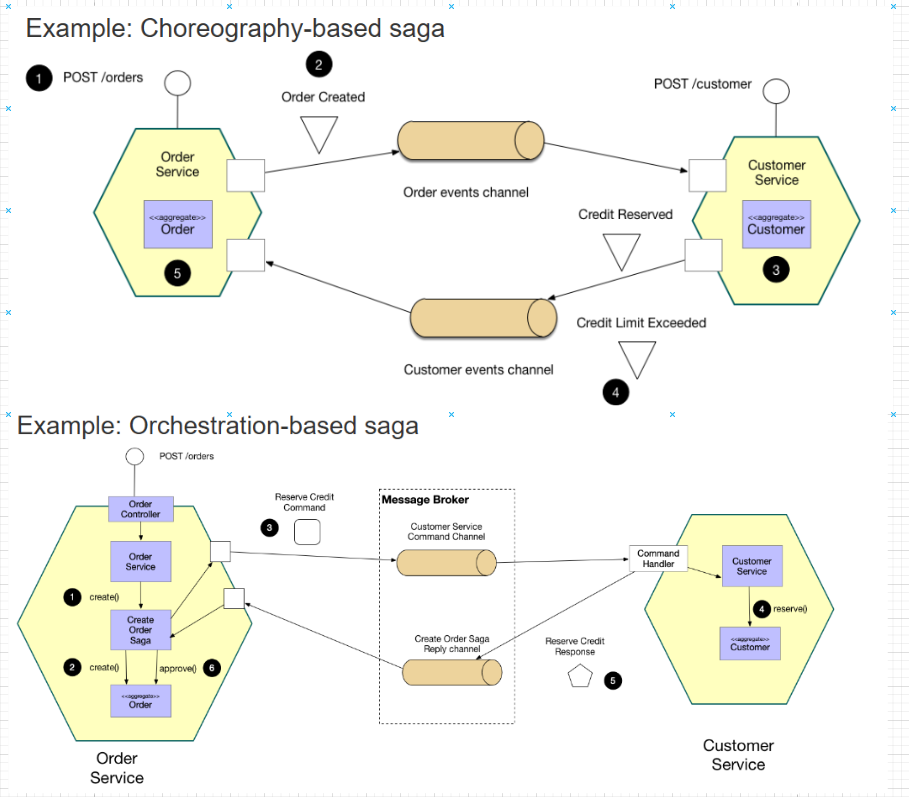

# Week 48 - Design Patterns
## Objectives
This week is a self-study on microservices design patterns. You should have be now already implemented one, the API gateway. The goal is to learn more about popular microservices design patterns and implement one in your Twitter system.

# Tasks
1. [goto](#1-research) **Research popular microservices design patterns.**
2. [goto](#2-identify) **Identify a design pattern that is a good fit for your Twitter system.**
3. [goto](#3-implement) **Implement the design pattern in your Twitter system.**

# Task response
*Here alle the response and speculation are listed. code snippets and images are displaying in content to explanation*

### 1. Research

**Sidecar Design Patten**
yolohoe

**SAGA desing patten**

This design-patten might be a good chose for the system in general, but at the state of the application, this is not what i would implement in the first round.

### 2. Identify
looking for a design patten that match the use-case for my twitter system. there are some key-features i look for.

### 3. Implement