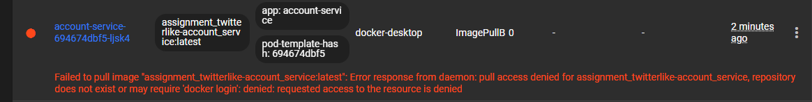
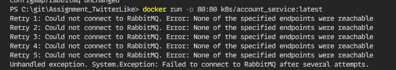
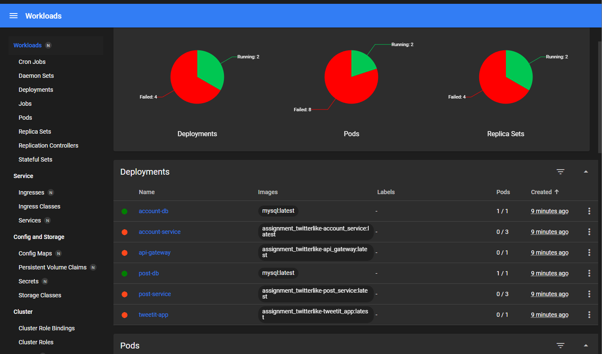
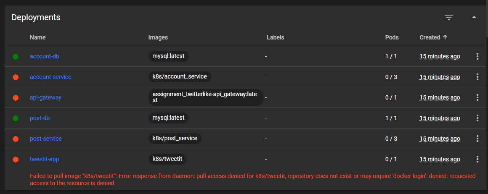

# Week 46: Kubernetes

#### Objectives
Deploy your Twitter system using Kubernetes.

# Tasks
1. **Create manifest files for your Twitter system.**
2. **Demonstrate a successful deployment of your Twitter system using Kubernetes.**


# 1. Create
*below you see the manifest yaml file, that setup the whole Twitter like system, following the same principle as the docker-compose*

````yml
apiVersion: v1
kind: Service
metadata:
  name: rabbitmq
spec:
  selector:
    app: rabbitmq
  ports:
  - name: rabbitmq
    port: 5672
    targetPort: 5672
  type: ClusterIP

apiVersion: apps/v1
kind: Deployment
metadata:
  name: account-service
spec:
  replicas: 3
  selector:
    matchLabels:
      app: account-service
  template:
    metadata:
      labels:
        app: account-service
    spec:
      containers:
      - name: account-service
        image: k8s/account_service:latest
        ports:
        - containerPort: 80
        env:
        - name: RABBITMQ_HOST
          value: "rabbitmq"
      volumes:
        - name: rabbitmq-config
          configMap:
            name: rabbitmq

````
[Sourcefile - Kubernetes](/tweetit.k8s.yaml)

# 2. Demonstrate
i've followed the guide for this class. and most of the elements are working fine. where i run into problems is when creating the local Docker repo. 

- [x] - Setup Kubernetes.
- [x] - Setup Dashboard.
- [x] - Apply manifest
- [ ] - Pods working correctly


````bash
  PS C:\git\Assignment_TwitterLike> kubectl apply -f tweetit.k8s.yaml
  deployment.apps/account-db unchanged
  deployment.apps/post-db unchanged
  deployment.apps/tweetit-app configured
  service/rabbitmq unchanged
  persistentvolumeclaim/account-db-storage unchanged
  persistentvolumeclaim/post-db-storage unchanged
  deployment.apps/post-service configured
  deployment.apps/account-service configured
  configmap/rabbitmq unchanged
````


## Debugging
*i have done something to try to fix it here are some of the problems i've tried*

````yaml
apiVersion: apps/v1
kind: Deployment
metadata:
  name: account-service
spec:
  replicas: 3
  selector:
    matchLabels:
      app: account-service
  template:
    metadata:
      labels:
        app: account-service
    spec:
      containers:
        - name: account-service
        image: k8s/account_service:latest
        ports:
        - containerPort: 80
        env:
        - name: RABBITMQ_HOST
          value: "rabbitmq"
      volumes:
        - name: rabbitmq-config
          configMap:
            name: rabbitmq
````

*Opening the dashboard, the manifest are implemented, but we get this error*


*Running the image locally seems to be working correctly, so why the k8s can't reach it i don't understand*


*I tried to do both tags, as you see under*



*When i build the docker for local tag witch is working fine*
````bash
PS C:\git\Assignment_TwitterLike> docker build . -f TweetIt/Dockerfile -t k8s/tweetit
````

# Conclusion
Despite not successfully deploying Kubernetes, I learned a lot from the experience. A notable highlight was getting Kubernetes set up and applied manifests. Unfortunately, I encountered an issue with linking Docker images correctly that held me back.

[Return:Home](/README.md)
