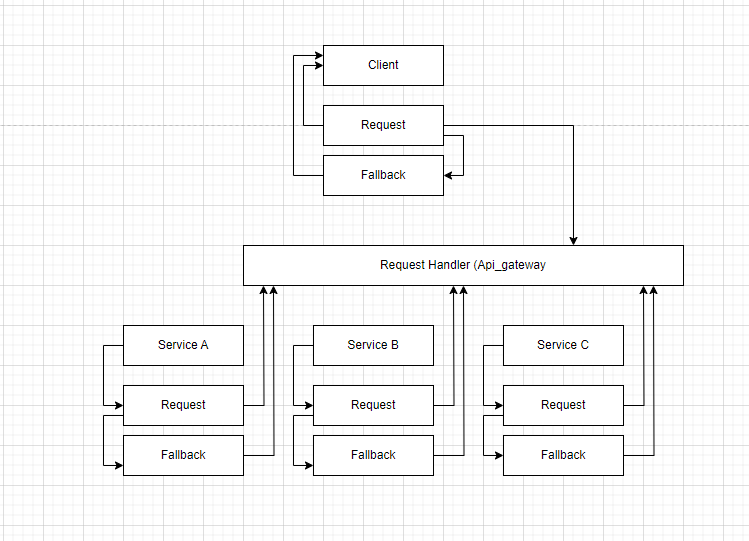

# **Reliability**

## Tasks
1. Identify key areas of failure in your system.
2. Propose and implement mitigations for the identified failure points.
3. Document how you've made features of your system more reliable.
---
### Expectations
A thoughtful analysis of your system and how to improve its reliability and a set of mitigations that address the identified failure points.

The system as it is right now have reliability problems. "talk about if the connection is lost, how this can be a problems for the system"


### 1. Identify key areas...
The system, as it currently stands, has reliability issues. Specifically, I'm concerned about the potential problems that arise when the connection is lost. If the connection to another service or component is disrupted, the entire system could be negatively impacted, leading to errors, data loss, and potentially even a complete failure of the application.


### 2. propose and implement mitigation...
I've been researching various patterns and designs that can help our system handle different types of errors, and after some reading and experimentation, I discovered that the circuit-breaker design pattern could be a game-changer. By adding a feature to handle errors internally, this pattern can solve many problems and improve the overall robustness of our system.

**my solution would look something like this.**



### 3. Document how you've made features

[RabbitMqDefault/Tools/CircuitBreaker.cs](/RabbitMqDefault/Tools/CircuitBreaker.cs)

Implementing a simple circuit breaker provides a clear way to handle various types of errors within our services. As I developed the pattern, I added some common fallback mechanisms to ensure robustness.

The following mechanisms were implemented:

1. maxFailures: This setting determines the maximum number of failures allowed before the circuit is tripped.
2. timeout: This timeout value ensures that the circuit is released after a specified period if no failures occur.

To utilize this class, I modified the RabbitMQ library to incorporate try-catch blocks, making it easy for different services to adopt the circuit breaker pattern.
[codeSnippets/Circuitbreaker.cs](./codeSnippets/Circuitbreaker.cs)

moving to the logout service inside the Account-service we can see how this is handled
[codeSnippets/callbackCircuitbreaker.cs](./codeSnippets/callbackCircuitbreaker.cs)

by doing this we have create a fallback policy, by using the circuit-breaker design patten.


**Execute Async**
````csharp
  public async Task ExecuteAsync(Func<Task> action, Action onFallback = null)
  {
    if (state == CircuitBreakerState.Open)
    {
        if (DateTime.Now - lastFailureTime > timeout)
        {
            state = CircuitBreakerState.HalfOpen;
        }
        else
        {
            onFallback?.Invoke();
            return;
        }
    }
    try
    {
        await action();
        Reset();
    }
    catch (Exception ex)
    {
        HandleFailure(ex, onFallback);
    }
  }
````

**Aditional**
I created a Abstract class to capsulate the Circuit-breaker inside the services, to make the usage easier...

[source](/RabbitMqDefault/interfaces/AService.cs)
````csharp
    //- Running the virtual voids, and analyze the return of each, inside the circuit-breaker, The fallback. will call the error on the broker sender.
  public void Start(string connectionString, string routingKey){
    CircuitBreaker circuitBreaker = new CircuitBreaker(10, TimeSpan.FromSeconds(5));

    circuitBreaker.Execute(
      action: ()=>{
        if(!OnInit()) //- Invoke the Init void
          throw new Exception();
        consumer = new RMQ_Recieve(connectionString, routingKey);
        consumer.StartListening((message)=>{
          if(OnInvoke(message) == ServiceState.Ok) //- Invoke the Main void
            return payload;
          else return Error_return;
        });
      },

      onFallback: onFallback //- Invoke the fallback void
    );
  }
````
[Return:Home](/README.md)
