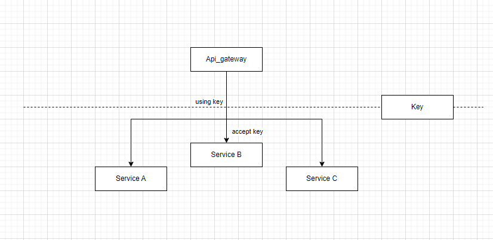
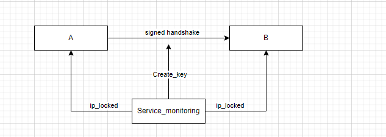
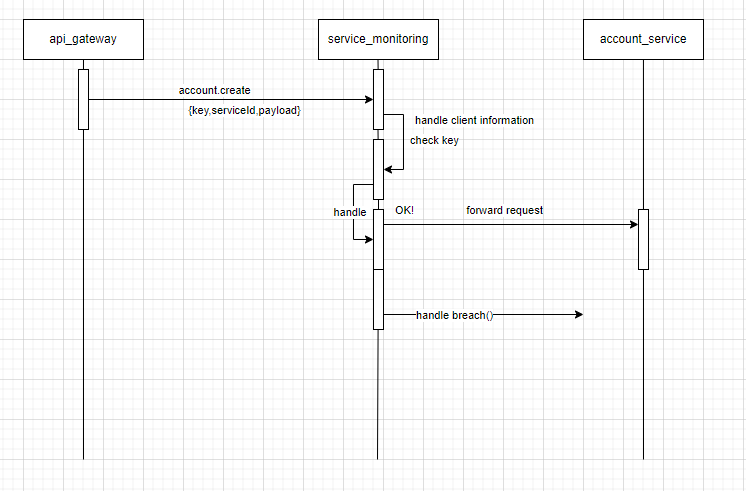

# Week 47 - Security
## Objectives
  Implement security measures for your Twitter system.

# Tasks
1. [Go To](#1-identify) Identify potential security risks in your system, such as microservice-to-microservice communication.
2. [Go To](#2-propose) Propose and implement mitigations for the identified security risks.
3. [Go To](#3-document) Document how you've secured your Twitter system (README.md is fine).

# 1. Identify
i have a hard time identifying the problems that could come using the microservice to microservice communication.
for the first security wall, we' have created a API gateway, that isolate the different routes that are open for the network outside.

another problem is to isolate the the network, this can be done inside the docker-compose.
using services outside the network, for the splitting the system on the X-axis, using static addresses to insure that only a range of addresses can be used to request different elements of the linked systems outside the network.

since im using a normal TCP-protocol (Json) to communicate between the services, i can encrypt the stream, or create a key, that are needed by the services to be activated, this way, even if someone gets inside, the data could not be read or used. also called zero trust.

going inside this deep hole of security, it might be important to address flaws inside the company and others.

# 2. Propose
Here i don't see the reason to use some of the technology from the classes that there are build in different types of encryption mechanism & signing. that easy can be used to make the services more secure.

First i will create a system that can lock services by using a key, this key is uniq and can only be used by the system once, and only one with they key can be active at the time. when the system starts up, or a given time i meet. the system will create new keys depends on the active system, and lock the system, this can be done by a static ip-address.

The service monitoring should be seen as a engine, to create and monitor the keys in the network. it is also the systems responsibility to handle acceptance of the request, and handle outside requests.

using a closely monitored key system, access to the other services using a wrong key, will indicate some one is trying to access areas that should be closed. with that some breach protocol could be used to stop the remove the thread from the infrastructure.

# 3. Document
i've been thinking what i should do, given the time i have to develop this. and this is what i came up with.

The service system, only look at the key, and call information, inside the monitoring, the system look up the key, and linked call information, if they match, the service are forwarded to the service, else some security measurement is activated.

inside the *service_monitoring* the public key, for the service is also stored to handle the payload. in this way, the sensitive information can be encrypted by the services.

given the current usage of the RabbitMq, and my experience with it, i don't know if i can create a service que, that always will be called first. therefore i will use a different approach to the solution. since all are running a console application in c# i can create a *service_monitoring* system, that need to be invoked before an service can be activated. 

>[!NOTE]
> i have not implemented it inside the system, but just created some mock code, to simulate what i think it should look like. i have not implemented it, because im running out of time after had to create the system from scratch again.

[ServiceMonitoring.cs](/ServiceMonitoring/ServiceMonitoring.cs)

[Program.cs](/ServiceMonitoring/Program.cs)

this can be build on top of  all services, and can be build into the Rabbit mq lib i've created to automate the call before calling a service.