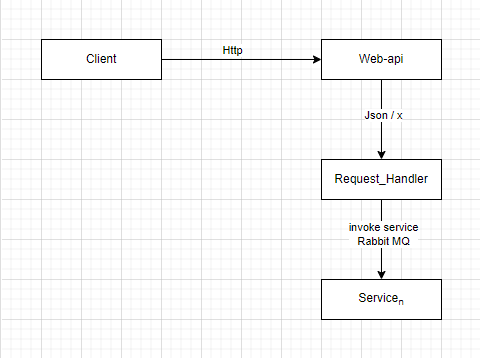
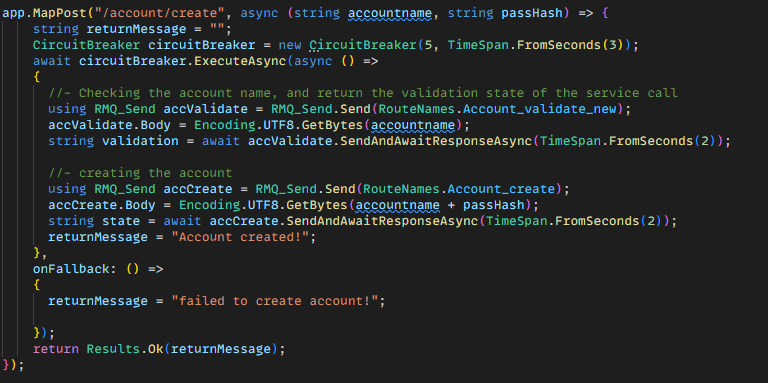
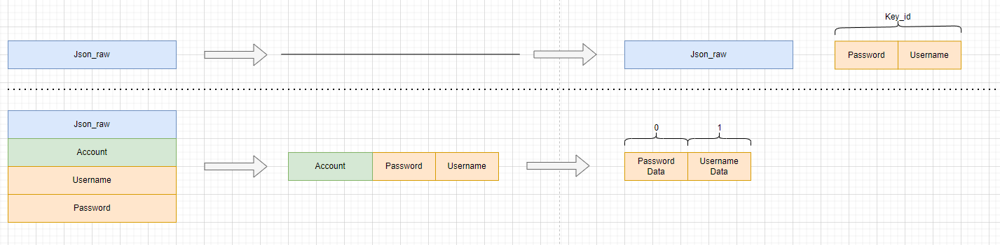
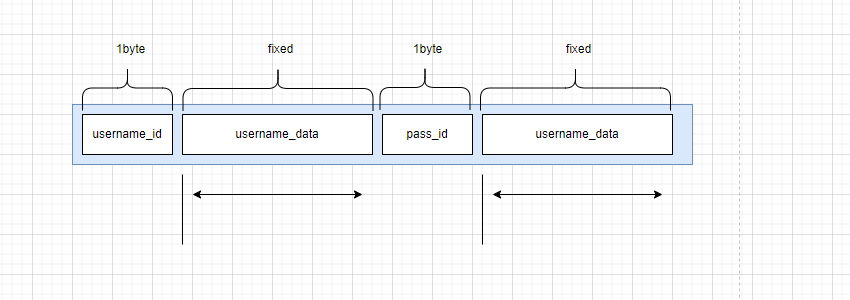

# Week 44 - API Gateways

# Tasks
1. [GoTo](#1-analyze) **Analyze the current system and how a client would interact with it.**
2. [GoTo](#2-update) **Update your system architecture diagram to include the API Gateway.**
3. [GoTo](#3-implement) **Implement the API Gateway using e.g. Ocelot.**


## 1. Analyze
different from the system that are being develop by the teacher, i've gone a different direction with the development of the microservice systems. This means I already have/need a Api-gateway to handle the request from the client. In my current system i have not used Ocelot as my base gateway.

**System Description** i've those to use RabbitMQ with a Tcp-protocol, and in the current system, i'm just using text to send different messages to the services. normally i would use a more low-level protocol to stream data between the client-services for better performance and less overhead that http i know for.

so back to the original question: how a client would interact with my system.



the image display how, the system i designed to handle client requests. on the image the client send some web-based request that the server handle. after handling the http request, the server create a task, that invoke all services needed to complete the task.

this way, the system is better suited for performance and at the same time isolated from the client. making the system more secure.


## 2. Update
Nothing really changes on my system architecture diagram. Since i'm using an other communication protocol between the services, i need to have a layer to translate the user request to a format the services understand, and vice versa.


## 3. Implement
I've followed the class and created the Ocelot framework to the project, just to demonstrate that i have played around with it.

*Ocelot Json file*
[Ocelot.json](/TweetIt_apiGateway/ocelot.json)

But since Ocelot are http base gateway, this solution would not be the right fit for my system. And after some research after an better framework there are some that might be useful for the project.
while doing the research i've found a couple of frameworks that could be great for my type system.

#### 1. **_Kong Gateway:_**
  - ***Key-features***
    - *Multi-Protocol Support: Http, WebSockets, gRPC, TCP and UDP*
    - *Service Discovery: Kong integrates with service discovery tools (e.g., Consul) for dynamic routing and scaling.*
    - *Admin API: Provides an admin API to configure, monitor, and manage the gateway.*

  - ***Use Case***
    - *Kong is widely used in cloud-native and hybrid architectures. It’s suitable for large-scale, high-performance use cases and integrates well with other Kubernetes-based services.*

  Kong-Gateway can be setup inside docker
  ```bash
    docker network create kong-net
    docker run -d --name kong-database \
      --network kong-net \
      -e "KONG_DATABASE=off" \
      -e "KONG_PORT_MAP=true" \
      -e "KONG_PROXY_ACCESS_LOG=/dev/stdout" \
      -e "KONG_ADMIN_ACCESS_LOG=/dev/stdout" \
      -e "KONG_PORT_MAP=true" \
      kong:latest

    docker run -d --name kong \
      --network kong-net \
      -e "KONG_PORT_MAP=true" \
      -e "KONG_ADMIN_API_URI=http://kong:8001" \
      kong:latest
  ```

  In kong gateway a route can be created something like this
  ```cs
  var client = new RestClient("http://localhost:8001");
    var request = new RestRequest("routes", Method.Post);
    request.AddJsonBody(new
    {
        service = new { name = "my-service" },
        paths = new[] { "/my-service" } // Path that Kong listens to
    });

    var response = await client.ExecuteAsync(request);
  ```

#### 2. **Traefik**
  - ***Key Features:***
    - *Dynamic Configuration: Traefik dynamically updates its routing configuration based on changes in the service discovery or load balancer.*
    - *Multi-Protocol Support: Traefik can handle various protocols (HTTP, gRPC, WebSocket, etc.) natively.*
    - *Built-in Let's Encrypt Integration: Automatic SSL certificate management via Let's Encrypt.*
    - *Middlewares: Offers a range of built-in middlewares like authentication, rate limiting, and more*

  - ***Use Case:***
    - *Traefik is especially useful in containerized and Kubernetes environments for handling dynamic routing and supporting microservices with multiple protocols.*

#### Others:
4. **NGINX**: *Well-suited for high-performance, scalable API gateways supporting multiple protocols.*
5. **AWS API Gateway**: *Best for AWS-centric cloud architectures with full managed service capabilities.*
6. **Spring Cloud Gateway**: *Excellent for Spring-based applications with support for reactive programming.*


#### Conclusion
All the solutions could be used to handle the request from the client, but given the steps required to make a simple collection of task for calling different services the implementation of the frameworks do not make sense i current context. inside the project we have already worked with Circuit breaker patten, and RabbitMQ that together easy can be used to create a Api-gateway that handle actions and fallback for a list of service call.

additional adding more containers to the solution just add cost and increased usage of CO2, so if trying to make the software architecture more green, this could be created without the need of yet another docker container.

therefore i will use a combination of the Circuit breaker, and the RabbitMQ to handle client calls that need to be split into others.


## Solution
*Using the Circuit-breaker design patten together with the RMQ_Send class i can create a api call, with fallback mechanism*


#### How i works
1. First we create a **Circuit-Breaker** to isolate the call, adding fallback to the call.
2. Next we add the different Service call needed to complete the task. using the ```RMQ_Send.SendAndAwaitResponseAsync()``` we await, for the task, to be completed. inside the *RMQ_Send* a fallback is already created, so the circuit breaker, would break, of one of the task fail.
3. In the end we return the result to the user.


#### Notes
- This way a collection of different services can be called and used to do a more complex task. it's important to note, that the return from the services, can be used to concat to the next task, and this way handle the the return data.


- *Right now, this is a lot of code to do this, and a wrapper class can be created to isolate the logic and make it easy to use for the developer in the future. making the scalability easier and maintaining the system easier*


## Source code links
**Circuit Breaker**
[Circuit-breaker Source](/RabbitMqDefault/Tools/CircuitBreaker.cs)

**RMQ_Send**
[RMQ_Send Source](/RabbitMqDefault/RMQ_Send.cs)


# Task Conclusion
Reflecting over the whole task as a hole, Ocelot is a great fit for creating an API gateway for Http based Microservices.
But looking at the Http protocol it uses a lot of energy to make a simple call, and as a lot of focus is on green software architecture right now, using something else that is not text based would be more efficient.
Given the time we’re given to create this task, analyzing and developing a protocol that can be used to communicate with the services is not feasible.
But generally, I would look at the boiler text that is sent by the protocol. If we use Json as communication between the microservices, a layer should be created to remove static text, that doesn’t change and replace it with something smaller like an ID. This way the Json format can still be used to create requests.


*given a simple Json Request could look something like this.*


First the Stream and service have a Json file, that display how the file look, this could be a simple Json, displaying a username and password.

````json
{
  "account":{
    "username": "demoUser",
    "password": "demoHash"
  }
}
````
The Stream will look inside the Json file and create a model, that are without all the static text and index the json. from here different things could be added, if the username and password have a fixed size, the converting the stream could be efficient and don't need any parsing and seeking inside a request, and could get the data with O(1), and make the system more performant.



```cpp
[ 0x10 0x11 demoUser 0x02 demoHash]

```
inside the Stream an 1 byte id is given, gives the model a item range of 0 - 255 items. This id is used to identify the data, so if the Json changes in runtime, the service class will call for a new Json raw file, to map the data correctly, else it will directly take the data.


## Info
this way we remove a lot of overhead, and only use the Json file as a raw text once. also this make increase the performance by a factor x but still keep the readability for the developer that still can use Json as a markdown language


# End
**you might think why all this work for this?**

In recent years, software development has seen a significant increase in resource consumption, largely due to the growing emphasis on ease of use over efficiency. As user demands for more feature-rich, intuitive, and accessible applications have surged, developers often prioritize user-friendly designs and faster delivery over optimizing resource usage. This shift has led to applications that, while easier for users to interact with, tend to consume more memory, processing power, and bandwidth. The rise of cloud computing and scalable infrastructure has further enabled this trend, as developers are less concerned with the resource constraints of individual devices, knowing that backend systems can handle the load.

However, as this trend has grown, green software architecture has emerged as a response, emphasizing the need to reduce energy consumption and carbon footprints in software design. Despite this shift towards sustainability, many simple-to-use, but inefficient text-based protocols still persist. These protocols, while user-friendly, often require significant computational resources to process and transmit data. As a result, they can lead to increased energy usage, contributing to higher CO2 emissions. The environmental impact of these inefficient protocols has become a growing concern, as they highlight the trade-off between ease of use and sustainability. Thus, while software has become more accessible and intuitive, it is also consuming more energy, raising questions about its long-term environmental effects.